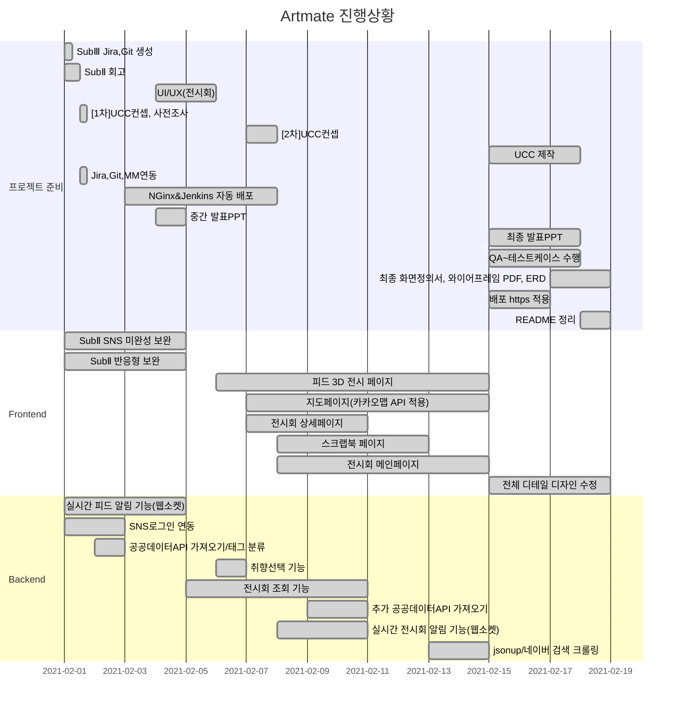

<p align="center">
  
  <br/>전시회 큐레이팅 SNS🎨
  <p align="center">
 
 
 
 
 
 
 
  </p>
<br/>  
<br/> 
</p>    
 
> 서비스명: 아트메이트(ARTMATE)  
> 팀명: 다우니네(B202)  
> 개발 기간: 2021.01.11 ~ 2021.02.19 (약 7주)  

### 📃문서
> [SubPJT1 노션 문서](https://www.notion.so/Sub-PJT1-e0891e06df84454da750b3c8f6f18109)     
> [SubPJT2 노션 문서](https://www.notion.so/Sub-PJT2-28ab40acd8104c0585008a3fa24f8f22)     
> [SubPJT3 노션 문서](https://www.notion.so/Sub-PJT3-2fad4b5e52bb4f3fba869bddfbeecc8f)  


## 🖌서비스 개요  
문화생활을 통해 즐거움을 얻고 싶은 사용자를 대상으로 전국의 전시회 정보를 지역별로 제공할뿐만 아니라 사용자 취향 기반의 전시 정보를 추천해줍니다. 또한, 개인 피드를 생성하여 다른 유저들과 SNS기능을 사용해 소통할 수 있으며 등록한 후기는 직접 3D 피드를 커스터마이징하여 집에서도 생생하게 나만의 3D 전시회를 즐길 수 있는 서비스입니다.   


## 🖌역할 분담  
| 팀원   | 역할 | 내용                        |
| ------ | ---- | --------------------------- |
| 정다운 | 팀장 | 백엔드 개발, UI디자인        |
| 김지형 | 팀원 | 프론트엔드 테크리더, GIT마스터, 화면정의서    |
| 유진이 | 팀원 | 프론트엔드 개발, QA(Jira관리), UI디자인 |
| 정현우 | 팀원 | 프론트엔드 개발, QA(Jira관리), 화면정의서            |
| 정혜지 | 팀원 | 백엔드 테크리더, 화면정의서           |  


## 🖌주요 기능  
* **회원가입/로그인 기능**  
  > a. 사용자 회원정보를 받아 메일인증 후 회원가입에 성공한다.  
  > b. 이외 간편 SNS로그인(카카오톡, 구글)으로 별도 인증 없이 빠르게 로그인할 수 있다.  
  > c. 가입 후 최초 로그인 시 사용자에게 전시 취향 태그를 입력 받는다.  
* **전시 정보 제공 기능**  
  > a. 전체, 베스트, 온라인, 현재 위치별로 분류하여 전시 정보를 제공한다.  
  > b. 사용자 취향 태그별로 맞춤형 전시회 정보를 제공한다.  
  > c. 전시회 상세 페이지에서는 전시회 이미지,이름,작가,장소,내용,소개말,기간 등의 상세 정보와 사용자들이 올린 후기 피드 리스트, 자세한 위치 정보를 제공한다.  
  > d. 관심 있는 전시회는 스크랩하여 스크랩북에서 관리할 수 있다.  
* **지도 기능**
  > a. 현재 위치를 기반으로 주변에 진행중인 전시회 정보와 장소를 지도에서 확인할 수 있다.  
  > b. 이외에도 전국의 모든 전시회 정보와 위치를 지도에서 확인 가능하다.  
* **SNS 기능**
  > a. 뉴스피드 페이지는 전체 피드/팔로우중인 피드/북마크 피드 순으로 분류된다.    
  > b. 마이 피드 페이지는 프로필 사진, 닉네임, 피드명, 소개말을 표시한다.  
  > c. 현재 사용자의 팔로워, 팔로우 리스트를 확인하고, 팔로우 신청/수락을 할 수 있다.  
  > d. 내 피드에서 3D 피드에 올리고 싶은 후기를 최대 10개까지 선택하고, 피드 테마를 설정해 나만의 3D 피드를 생성할 수 있다. 다른 유저의 3D 피드 또한 감상할 수 있다.  
  > e. 내 피드에서 글 작성/수정/삭제가 가능하고 글 작성 시 다녀온 전시회 이름을 작성하면 관련된 장소가 자동완성 된다.  
  > f. 피드 상세에서 댓글을 등록/수정/삭제하고 다른 유저가 남긴 댓글을 확인할 수 있다.  
  > g. 피드에 좋아요, 북마크 등록하고 현재 피드 링크를 복사해서 다른 SNS(네이버,카카오)에 공유할 수 있다.  
* **알림 페이지**  
  > a. 전시회 정보를 매일 주기적으로 알림 받아볼 수 있다.  
  > b. 다른 유저의 팔로우 신청, 팔로워가 새로 작성한 피드, 내 피드의 좋아요 알림을 받아볼 수 있다.   
* **검색 페이지**
  > a. 최근에 내가 검색한 키워드, 실시간 인기 검색어를 확인할 수 있다.  
  > b. 검색 결과 페이지에서 키워드가 포함된 유저와 전시회 리스트를 확인할 수 있다.  


## 🖌Gantt Chat
> 매일 오전 미팅 후 업데이트  


 

## ✔커밋 메시지
```bash
FE(BE)_날짜:완성한 기능(작업 부분-폴더명)
```
* [참고한 커밋 메시지 작성법](https://blog.ull.im/engineering/2019/03/10/logs-on-git.html)  


## ✔Branch 규칙  
```bash
develop/feature/기능명  
```  

## ✔Code Style
| FrontEnd   | BackEnd |
| ------ | ---- |
| 1. 폴더명: 첫글자 대문자<br/>→ ex) Feed/Add.vue <br/><br/>2. 파일명: 첫글자 대문자 <br/> → ex) Add.vue <br/><br/>3. 경로명: 소문자 → ex) /add | 1. 클래스명:  첫글자 대문자 + camel case <br/> ex) MainController.java <br/><br/> 2. 함수, 변수: 첫글자 소문자 + camel case <br/> ex) public void setUserName(); |
- if문
    - 한줄 일 때, Block 처리하기
    - else if / else /중괄호는 조건문 바로 옆에 붙이기

    ```java
    if(condition){
     statement;
    } else if(condition2){
     statement2;
    } else{
     statement3;
    }
    ```

- for
  
    - 단순 반복문은 iterator를 i,j,k,...,z순으로 명명하기
- 주석 상대방이 이해할 수 있도록 달기
    - /**/ 설명 여러줄 필요할 때 코드 위에 작성
    - // 간단한 주석 코드 옆에 작성

 
## ✔프로젝트 구조  
  


## 💻 주요 기능 미리보기  
### 1. 메인 화면           
  
메인 화면에서 순서대로 온라인 전시회, 사용자 취향 태그별 맞춤 전시회 제공, 좋아요 순으로 인기 피드, 현재 위치 기반으로 진행중인 전시회 리스트를 확인할 수 있습니다.  


### 2. 유저검색 및 전시회 검색 화면
   
최근 검색어,인기 검색어와 키워드가 포함된 유저/전시회 리스트를 확인할 수 있습니다.  
 
 
 
### 3. 3D 피드       
  
내가 작성한 피드를 커스터마이징하여 3D 피드를 생성하고 관리할 수 있습니다. 하단 좌측은 WASD버튼으로 이동할 수 있으며 우측 버튼으로 방향을 360도 회전시킬 수 있습니다.  


### 4. 전시회 페이지 및 스크랩북          
 
   
전시회 페이지는 전체/베스트/온라인/주변에 진행중인 전시회로 카테고리가 분류됩니다. 전시회 상세에서는 전시회 이미지, 이름, 전시 기간, 장소, 참여 작가, 소개말을 표시하고 관련된 피드 리스트로 넘어갈 수 있습니다. 또한, 현재 전시회의 위치를 지도에서 확인할 수 있으며 스크랩 버튼을 눌러 스크랩북에서 따로 관리할 수도 있습니다.   


# 📑산출물  
> 1. ER 다이어그램     
> 2. 화면정의서  
> 3. 와이어프레임   


##  🖌ER 다이어그램   
  


---    
 
## 🖌 화면 정의서        
[화면정의서 링크](https://github.com/dovvn/Artmate-PJT/blob/master/%EC%82%B0%EC%B6%9C%EB%AC%BC/2.%ED%99%94%EB%A9%B4%EC%A0%95%EC%9D%98%EC%84%9C/%ED%99%94%EB%A9%B4%EC%A0%95%EC%9D%98%EC%84%9C-%EC%B5%9C%EC%A2%85.pdf)     
 

## 🖌 와이어프레임  


