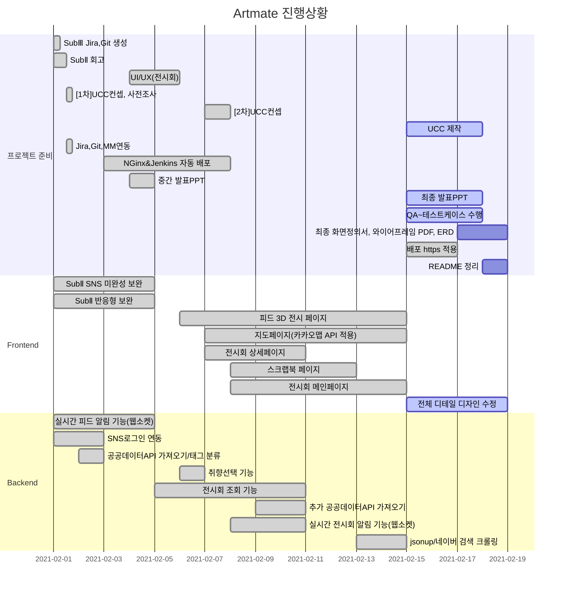

# 🎨 SUBPJT3 : SNS 웹 큐레이팅 서비스    
> 주제: 전시회 큐레이팅 SNS  
> 팀명: 2조(B202)  

### [SubPJT3 노션 문서](https://www.notion.so/Sub-PJT3-2fad4b5e52bb4f3fba869bddfbeecc8f)

## 🖌 팀원 역할
| 팀원   | 역할 | 비고                        |
| ------ | ---- | --------------------------- |
| 정다운 | 팀장 | 백엔드 개발, UI디자인        |
| 김지형 | 팀원 | 프론트엔드 테크리더, GIT마스터, 화면정의서    |
| 유진이 | 팀원 | 프론트엔드 개발, QA(Jira관리), UI디자인 |
| 정현우 | 팀원 | 프론트엔드 개발, QA(Jira관리), 화면정의서            |
| 정혜지 | 팀원 | 백엔드 테크리더, 화면정의서           |

## 🖌 기술 스택
         

## 🖌 Gantt Chat
> 매일 오전 미팅 후 업데이트  


---    
## ✔ 커밋 메시지
```bash
FE(BE)_날짜:완성한 기능(작업 부분-폴더명)
```
* [참고한 커밋 메시지 작성법](https://blog.ull.im/engineering/2019/03/10/logs-on-git.html)

## ✔ Branch 규칙  
```bash
develop/feature/기능명  
```

## ✔ Code Style
| FrontEnd   | BackEnd |
| ------ | ---- |
| 1. 폴더명: 첫글자 대문자<br/>→ ex) Feed/Add.vue <br/><br/>2. 파일명: 첫글자 대문자 <br/> → ex) Add.vue <br/><br/>3. 경로명: 소문자 → ex) /add | 1. 클래스명:  첫글자 대문자 + camel case <br/> ex) MainController.java <br/><br/> 2. 함수, 변수: 첫글자 소문자 + camel case <br/> ex) public void setUserName(); |
- if문
    - 한줄 일 때, Block 처리하기
    - else if / else /중괄호는 조건문 바로 옆에 붙이기

    ```java
    if(condition){
     statement;
    } else if(condition2){
     statement2;
    } else{
     statement3;
    }
    ```

- for
  
    - 단순 반복문은 iterator를 i,j,k,...,z순으로 명명하기
- 주석 상대방이 이해할 수 있도록 달기
    - /**/ 설명 여러줄 필요할 때 코드 위에 작성
    - // 간단한 주석 코드 옆에 작성

---   
## 🖌 기능
- 전시회 SNS 커뮤니티
    - 실시간 뉴스피드 목록
    - 피드 좋아요,팔로우,SNS공유 기능
    - 피드 목록 최신순으로 업데이트
    - 팔로우, 전시회 등의 알림 센터 기능
    - 내 게시글로 3D room 제작 및 공유 기능
- 전시회 정보 공유
    - 사용자 취향에 맞는 맞춤형 전시회 안내(해시태그 이용)
    - 스크랩북 기능  
    - 현재 내 지역 주변의 진행중인 전시회 안내
    - 원하는 날짜에 진행중인 전시회 안내
    - 키워드 검색 기능(인기 키워드/최근 키워드)
    - 사용자 후기 피드와 연결

## 💻 기능 스크린 화면 미리보기
### 1. 메인 화면           
      


### 2. 유저검색 및 전시회 검색 화면
            
 
 
 
### 3. 3D 피드       
        


### 4. 전시회 페이지 및 스크랩북          
            

---   

## 🖌 ER 다이어그램
  


---    
## 🖌 화면 정의서      
[바로가기](산출물/화면정의서-최종 작성.pdf)      


## 🖌 와이어프레임  


