# 🎨 SUBPJT3 : SNS 웹 큐레이팅 서비스    
> 주제: 전시회 큐레이팅 SNS  
> 팀명: 2조(B202)  

### [SubPJT3 노션 문서](https://www.notion.so/Sub-PJT3-2fad4b5e52bb4f3fba869bddfbeecc8f)

## 🖌 팀원 역할
| 팀원   | 역할 | 비고                        |
| ------ | ---- | --------------------------- |
| 정다운 | 팀장 | 백엔드 개발, UI디자인        |
| 김지형 | 팀원 | 프론트엔드 테크리더, GIT마스터, 화면정의서    |
| 유진이 | 팀원 | 프론트엔드 개발, QA(Jira관리), UI디자인 |
| 정현우 | 팀원 | 프론트엔드 개발, QA(Jira관리), 화면정의서            |
| 정혜지 | 팀원 | 백엔드 테크리더, 화면정의서           |

## 🖌 기술 스택
         

## 🖌 Gantt Chat
> 매일 오전 미팅 후 업데이트  

```mermaid  
gantt
    title Artmate 진행상황
    dateFormat  YYYY-MM-DD
    section 프로젝트 준비
    SubⅢ Jira,Git 생성  :done, 2021-02-01, 6h
    SubⅡ 회고          :done, p2,2021-02-01, 12h
    UI/UX(전시회)   :done,2021-02-04,2d
    [1차]UCC컨셉, 사전조사   :done,after p2,6h
    [2차]UCC컨셉   :done,2021-02-07,1d
    UCC 제작   :active,2021-02-15,3d

    Jira,Git,MM연동   :done,after p2,6h
    NGinx&Jenkins 자동 배포 :done, 2021-02-03,5d
    중간 발표PPT: done,2021-02-04,1d
    최종 발표PPT: active,2021-02-15,3d
    QA~테스트케이스 수행: active,2021-02-15,3d
    최종 화면정의서, 와이어프레임 PDF, ERD: ,2021-02-17,2d
    배포 https 적용:done,2021-02-15,2d
    README 정리: ,2021-02-18,1d
    
    
    

    section Frontend
    SubⅡ SNS 미완성 보완          :done, 2021-02-01, 4d
    SubⅡ 반응형 보완          :done, 2021-02-01, 4d
    피드 3D 전시 페이지   :done,2021-02-06,9d
    지도페이지(카카오맵 API 적용):done,2021-02-07, 8d
    전시회 상세페이지   :done,2021-02-07,4d
    스크랩북 페이지   :done,2021-02-08,5d
    전시회 메인페이지 :done, 2021-02-08, 7d

    전체 디테일 디자인 수정   :active,2021-02-15,4d
    
    
    section Backend
    실시간 피드 알림 기능(웹소켓)          :done, 2021-02-01, 4d
    SNS로그인 연동          :done, 2021-02-01, 2d
    공공데이터API 가져오기/태그 분류          :done, p1, 2021-02-02, 1d
    취향선택 기능:done,2021-02-06,1d
    전시회 조회 기능:done,2021-02-05,6d
    추가 공공데이터API 가져오기          :done, p1, 2021-02-09, 2d
    실시간 전시회 알림 기능(웹소켓)          :done, 2021-02-08, 3d
    jsonup/네이버 검색 크롤링     :done, 2021-02-13,2d
```


## ✔ 커밋 메시지
```bash
FE(BE)_날짜:완성한 기능(작업 부분-폴더명)
```
* [참고한 커밋 메시지 작성법](https://blog.ull.im/engineering/2019/03/10/logs-on-git.html)

## ✔ Branch 규칙  
```bash
develop/feature/기능명  
```

## ✔ Code Style
| FrontEnd   | BackEnd |
| ------ | ---- |
| 1. 폴더명: 첫글자 대문자<br/>→ ex) Feed/Add.vue <br/><br/>2. 파일명: 첫글자 대문자 <br/> → ex) Add.vue <br/><br/>3. 경로명: 소문자 → ex) /add | 1. 클래스명:  첫글자 대문자 + camel case <br/> ex) MainController.java <br/><br/> 2. 함수, 변수: 첫글자 소문자 + camel case <br/> ex) public void setUserName(); |
- if문
    - 한줄 일 때, Block 처리하기
    - else if / else /중괄호는 조건문 바로 옆에 붙이기

    ```java
    if(condition){
     statement;
    } else if(condition2){
     statement2;
    } else{
     statement3;
    }
    ```

- for
  
    - 단순 반복문은 iterator를 i,j,k,...,z순으로 명명하기
- 주석 상대방이 이해할 수 있도록 달기
    - /**/ 설명 여러줄 필요할 때 코드 위에 작성
    - // 간단한 주석 코드 옆에 작성


## 🖌 기능
- 전시회 SNS 커뮤니티
    - 실시간 뉴스피드 목록
    - 피드 좋아요,팔로우,SNS공유 기능
    - 피드 목록 최신순으로 업데이트
    - 팔로우, 전시회 등의 알림 센터 기능
    - 내 게시글로 3D room 제작 및 공유 기능
- 전시회 정보 공유
    - 사용자 취향에 맞는 맞춤형 전시회 안내(해시태그 이용)
    - 스크랩북 기능  
    - 현재 내 지역 주변의 진행중인 전시회 안내
    - 원하는 날짜에 진행중인 전시회 안내
    - 키워드 검색 기능(인기 키워드/최근 키워드)
    - 사용자 후기 피드와 연결

> ✅  메인 화면


## 🖌 ER 다이어그램
  


## 🖌 화면 정의서


## 🖌 와이어프레임  


